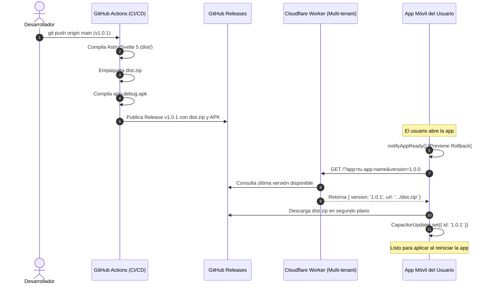

# 🚀 Mobile Hybrid Starter Template

Template oficial de alto rendimiento para el desarrollo de aplicaciones móviles híbridas (Android & iOS) con **Astro**, **Svelte 5**, **Tailwind CSS v4** y **Capacitor v8**, equipado con un sistema nativo y gratuito de **Auto-Actualizaciones Over-The-Air (OTA)** mediante **Cloudflare Workers** y **GitHub Actions**.

---

## ⚡ Stack Tecnológico

| Capa | Tecnología | Características |
| :--- | :--- | :--- |
| **Framework Web** | [Astro v5](https://astro.build/) | Modo SPA estático optimizado (`output: 'static'`) |
| **Componentes UI** | [Svelte 5](https://svelte.dev/) | Reactividad moderna mediante Runes (`$state`, `$derived`, `$effect`) |
| **Estilos & FX** | [Tailwind CSS v4](https://tailwindcss.com/) | Safe areas dinámicas (`pt-safe`, `pb-safe`), glassmorphism y toque nativo |
| **Runtime Nativo** | [Capacitor v8](https://capacitorjs.com/) | Acceso al hardware, Haptics, StatusBar, App Lifecycle |
| **Actualizaciones OTA** | [@capgo/capacitor-updater](https://capgo.app/) | Actualizaciones instantáneas sin pasar por tiendas ni costes de servidores |
| **Distribución Cloud** | [Cloudflare Workers](https://workers.cloudflare.com/) | Worker multi-tenant (`mobile-ota-updater.fede-eagle.workers.dev`) |
| **CI / CD** | GitHub Actions | Compilación de `dist.zip`, generación de `app-debug.apk` y GitHub Releases automáticos |

---

## 🏎️ Quickstart: Cómo usar este Template para una nueva App

### 1. Clonar o utilizar como Template
Crea un nuevo repositorio en GitHub a partir de este template y clónalo en tu equipo:
```bash
git clone https://github.com/TU_USUARIO/TU_NUEVA_APP.git
cd TU_NUEVA_APP
npm install
```

### 2. Personalizar y Renombrar la Aplicación
Para adaptar el template a tu nueva app, modifica únicamente 3 archivos clave:

1. **`capacitor.config.ts`**:
   ```typescript
   const config: CapacitorConfig = {
     appId: 'com.tuempresa.tuapp', // 👈 ID único de tu paquete Android/iOS
     appName: 'Mi App Increíble',   // 👈 Nombre visible en la pantalla de inicio
     webDir: 'dist',
     // ...
   };
   ```

2. **`src/lib/otaUpdater.js`**:
   Configura el nombre único que consultará el Cloudflare Worker multi-tenant:
   ```javascript
   export const DEFAULT_APP_NAME = 'tu-app-name'; // 👈 Nombre registrado en el Worker
   ```

3. **`package.json`**:
   Actualiza el `name`, `description` y la versión inicial (`1.0.0`).

### 3. Generar Iconos y Splash Screens Nativos desde el Día 1 🎨
Para evitar que tu app se compile con el icono y splash screen de Android por defecto:
1. Coloca tu logotipo o iconos en la carpeta `assets/` (el template ya incluye placeholders listos):
   - `assets/icon-only.png` (1024x1024)
   - `assets/icon-foreground.png` y `assets/icon-background.png` (1024x1024)
   - `assets/splash.png` y `assets/splash-dark.png` (2732x2732)
2. Ejecuta el generador nativo:
   ```bash
   npm run assets:generate
   ```
   *Esto generará automáticamente todas las densidades de iconos adaptativos (`mipmap-*`) y splash screens (`drawable-*`) en Android e iOS.*

### 4. Configurar Permisos en GitHub Actions ⚠️ *(Paso Crítico)*
Para que el pipeline de CI/CD pueda crear GitHub Releases y subir los archivos `dist.zip` y `app-debug.apk`:

1. Ve a tu repositorio en GitHub: **Settings** > **Actions** > **General**.
2. Desplázate hasta la sección **Workflow permissions**.
3. Selecciona: **Read and write permissions**.
4. Marca la casilla **Allow GitHub Actions to create and approve pull requests** (opcional pero recomendado).
5. Haz clic en **Save**.

---

## 🔄 ¿Cómo funciona el Sistema OTA Gratuito?



### 💡 Ciclo de Vida: `notifyAppReady()`
Capgo cuenta con un mecanismo que **revierte automáticamente al bundle anterior** si la nueva versión falla al arrancar. Por ello, el módulo `src/lib/otaUpdater.js` invoca `notifyAppReady()` en el montaje inicial del componente raíz (`App.svelte`).

---

## 🛠️ Comandos de Desarrollo

| Comando | Descripción |
| :--- | :--- |
| `npm run dev` | Inicia el servidor de desarrollo local de Astro (`http://localhost:4321`) |
| `npm run build` | Compila el frontend estático SPA a la carpeta `dist/` |
| `npm run bundle:ota` | Compila y genera el archivo comprimido `dist.zip` para OTA |
| `npm run assets:generate` | Genera todos los iconos adaptativos y splash screens en `android/` y `ios/` |
| `npm run cap:sync` | Compila el frontend y sincroniza los cambios con las carpetas nativas |
| `npm run cap:open:android` | Abre el proyecto en Android Studio |
| `npm run cap:open:ios` | Abre el proyecto en Xcode (requiere macOS) |
| `npm run bump:patch` | Incrementa versión de parche en `package.json` (ej: 1.0.0 ➔ 1.0.1) |
| `npm run bump:minor` | Incrementa versión menor (ej: 1.0.0 ➔ 1.1.0) |
| `npm run bump:major` | Incrementa versión mayor (ej: 1.0.0 ➔ 2.0.0) |

---

## 🚀 Cómo Publicar una Actualización OTA en Segundos

Para enviar una actualización instantánea a todos los usuarios sin pasar por revisión de Google Play o App Store:

1. Realiza tus cambios en el código (`src/components/`, `src/lib/`, estilos, etc.).
2. Incrementa la versión:
   ```bash
   npm version patch   # O usa: npm run bump:patch
   ```
3. Sube los cambios a GitHub:
   ```bash
   git add .
   git commit -m "feat: nueva mejora en la aplicación"
   git push origin main
   ```
4. **Automático:** GitHub Actions compilará `dist.zip`, creará el Release con la nueva versión y el Cloudflare Worker distribuirá la actualización a todos los dispositivos en segundo plano.

---

## ⚖️ Distinción Clave: ¿Cambio OTA o Nuevo APK/IPA?

| Tipo de Modificación | ¿Viaja por OTA? | ¿Requiere Compilar Nuevo APK/IPA? |
| :--- | :---: | :---: |
| Pantallas, componentes Svelte, lógica JavaScript, CSS | ✅ **SÍ (Instantáneo)** | ❌ No |
| Nuevas imágenes o assets web en `public/` o `src/` | ✅ **SÍ (Instantáneo)** | ❌ No |
| Modificación de Iconos de Launcher (`assets/`) o Splash nativo | ❌ No | ✅ **SÍ (Obligatorio)** |
| Nuevos plugins nativos de Capacitor (`npm i @capacitor/...`) | ❌ No | ✅ **SÍ (Obligatorio)** |
| Permisos de Android en `AndroidManifest.xml` o iOS `Info.plist` | ❌ No | ✅ **SÍ (Obligatorio)** |
| Configuraciones en `capacitor.config.ts` (`appId`, splash background) | ❌ No | ✅ **SÍ (Obligatorio)** |

---

## 🏷️ Visualización de Versión y Diagnóstico OTA en la App

El template incluye el componente reactivo [`src/components/VersionBadge.svelte`](file:///d:/Proyectos/Personal/Mobile-dev-template/src/components/VersionBadge.svelte) y el store reactivo `appVersion` desde `src/lib/otaUpdater.js`:

- **Store Reactivo `appVersion`:** Puedes suscribirte en cualquier componente Svelte con `$appVersion` para obtener la versión activa actual en tiempo real.
- **Modo `chip`:** Píldora sutil con indicador de estado (verde para versión al día, pulso para actualización lista) en cabeceras o toolbars.
- **Modo `footer`:** Texto discreto en el pie de página de las pantallas (`v1.0.0 (OTA) • Tocar para info`).
- **Modal de Diagnóstico:** Al pulsar sobre el badge, el usuario o tester puede ver si el código activo proviene de un bundle OTA o del binario base instalado, además de forzar una comprobación manual inmediata.

---

## 📱 Probar en un Dispositivo Android Local

1. Asegúrate de tener instalado **Android Studio** con Android SDK y Java JDK 21 o 17.
2. Ejecuta:
   ```bash
   npm run cap:add:android  # Solo la primera vez
   npm run cap:sync
   npm run cap:open:android
   ```
3. En Android Studio, presiona **Run 'app'** con un emulador o un teléfono conectado por USB con depuración activada.

---

## 📋 Checklist de Despliegue para Producción

- [ ] ¿Se actualizó `appId` y `appName` en `capacitor.config.ts`?
- [ ] ¿Se definió el identificador de la app en `DEFAULT_APP_NAME` en `src/lib/otaUpdater.js`?
- [ ] ¿Están activos los permisos **Read and write permissions** en GitHub Actions?
- [ ] ¿Incrementaste la versión en `package.json` (`npm run bump:patch`) antes de hacer push a `main`?
- [ ] ¿Si agregaste un plugin nativo de Capacitor, compilaste e instalaste el nuevo APK en lugar de confiar solo en el OTA?

---

## 🤖 Guía para Asistentes de IA
Si estás utilizando herramientas con IA (Antigravity, Cursor, Claude, GitHub Copilot), consulta las directrices técnicas detalladas en el archivo [`AGENTS.md`](./AGENTS.md).
